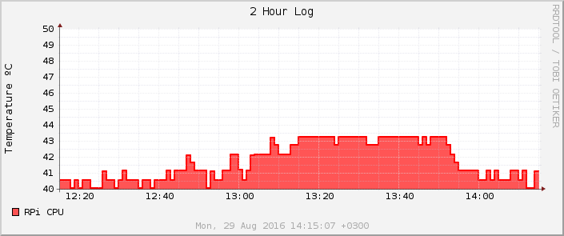
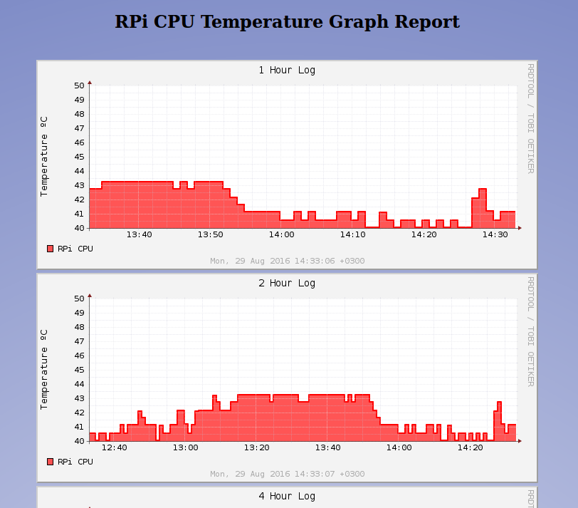

# CPU Temperature

CPU temperature monitoring is vital for administering a system, especially when it comes to server maintenance. With Raspberry Pi being widely used as a home server, completing this tutorial will provide you a way of checking CPU temperature of your Raspberry Pi through a webpage.

## Retrieving CPU temperature

First of all, you need to get access to a terminal on your Raspberry Pi by creating an `SSH` connection to it, or by executing `LXTerminal` application. Then run the following command to view CPU temperature:
```bash
/opt/vc/bin/vcgencmd measure_temp
```

Output:
```bash
temp=40.6'C
```

## Create a Shell script that prints temperature to console

A shell script is a computer program that contains commands otherwise executed one-by-one by a shell (i.e. Bash), known also as a command-line interface/interpreter (CLI).

During this tutorial, two shell scripts will be developed.

The first one will be used to:
  - Create a Round Robin Database
  - Retrieve CPU temperature and store it in the database &
  - Create a webpage to display the logged data

The second one will be used to:
  - Graphically represent the data stored in the database

Both scripts will be executed by Bash (Bourne Again SHell), a [Unix](https://en.wikipedia.org/wiki/Unix)-like shell available on [Raspbian](https://www.raspberrypi.org/downloads/raspbian/).

Take a look at the following code:
```bash
#!/bin/bash

TEMP_READING=$(/opt/vc/bin/vcgencmd measure_temp)
TEMP_VALUE=${TEMP_READING:5:4}
echo ${TEMP_VALUE}
```

What it does:
  - `TEMP_READING`: A variable that is assigned the output of the command retrieving CPU temperature (i.e `temp=40.6'C`). In Bash, $(_\<command\>_) is replaced with the output of _\<command\>_.
  - `TEMP_VALUE`: A variable that is assigned the numerical value of the temperature (i.e. `40.6`). This is done by using string manipulation. In Bash `${str:pos:len}` extracts `len` characters from string `str`, starting at position `pos`.
  - `echo`: A command that prints the contents of `TEMP_VALUE` variable to console.

As you can see, when assigning a value to a variable only the name of the variable is used. On the other hand, using the `$` symbol is required to retrieve the value of a variable. `$MYVAR` has the same effect as `${MYVAR}`.

You can test the code above by storing it to a file (i.e. `get_temp.sh`) and executing it by running: `./get_temp.sh`. If you encounter a `Permission denied` message, run `chmod 700 get_temp.sh` before executing the script again.

## Create a Round Robin Database

A Round Robin Database (RRD) is a time series database. RRD expects data to be stored in it at given intervals (step). If no value is supplied during an interval, `NaN` (*UNKNOWN*) is stored.

Creating a database to store CPU temperature:

```bash
rrdtool create cputemp.rrd \
	--start now \
	--step 60 \
	--no-overwrite \
	DS:cpu_temp:GAUGE:120:U:U \
	RRA:AVERAGE:0.5:1:535680
```

Don't get confused by `\` character. It is used to let the shell know that the following line is part of the current command.

In simple terms, the `rrdtool create` command above creates a RRD named *cputemp.rrd* that:
  - Starts "accepting" values since `now`.
  - Stores one value every *60 seconds* (`--step 60`).
  - Refers to the set of provided values as `cpu_temp`.
  - Has enough space to store **535680** values (= 12months * 31days * 24hours * 60minutes).
  - Calculates and stores the *average*, in case multiple values are supplied during the same interval (= 60 seconds).

**Attention**: No action takes place if the database already exists (`--no-overwrite`).

Documentation of `rrdtool create` can be found [here](http://oss.oetiker.ch/rrdtool/doc/rrdcreate.en.html).

## Store data in a RRD

Storing data in a RRD is extremely simple and it is done by `rrdtool update` command.

The command below stores value **7** in *cputemp.rrd*:
```bash
rrdtool update cputemp.rrd 1412800000:7
```
**1412800000** is the number of seconds since 1970-01-01 00:00:00 UTC (Unix/Epoch time) and you can use the term *Timestamp* to refer to it.

To find out current time in Epoch time, run `date +%s`.

The `rrdtool update` command using current timestamp:
```bash
rrdtool update cputemp.rrd $(date +%s):7
```

Documentation of `rrdtool update` can be found [here](http://oss.oetiker.ch/rrdtool/doc/rrdupdate.en.html).

## Graphically represent data stored in a RRD

Fetching data from a RRD and plotting them can be done with `rrdtool graph` command.

Creating a graph depicting CPU temperature:

```bash
rrdtool graph graph.png \
	--start -2h \
	--title "CPU Temperature Log" \
	--vertical-label "Temperature ºC" \
	--width 600 \
	--height 200 \
	--color GRID#C2C2D6 \
	--color MGRID#E2E2E6 \
	--dynamic-labels \
	--grid-dash 1:1 \
	--font TITLE:10 \
	--font UNIT:9 \
	--font LEGEND:8 \
	--font AXIS:8 \
	--font WATERMARK:8 \
	--lazy \
	--watermark "$(date -R)" \
	DEF:cpu_temp=cputemp.rrd:cpu_temp:AVERAGE \
	AREA:cpu_temp#FF0000AA:"RPi CPU" \
	LINE2:cpu_temp#FF0000
```

Very briefly, the `rrdtool graph` command above creates a *PNG* file named *graph.png* that:
  - Graphically represents the data stored the last 2 hours (`--start -2h`) &
  - `cpu_temp` is the set of data that is plotted.

All other options are mainly used for configuring the appearance of the graph. If you are interested in learning more about the available options refer to documentation. 

Output of `rrdtool graph`:



Documentation of `rrdtool graph` can be found [here](http://oss.oetiker.ch/rrdtool/doc/rrdgraph.en.html).

## Bash: Output redirection

Running `echo "Hello World"` will print **Hello World** to console. In Bash, you can redirect that output to a file.

Executing `echo "Hello Raspberry Pi fans!" > hello.txt` will create file **hello.txt** and it's contents will be set to match **Hello Raspberry Pi fans!**. If the file already exists, it will be truncated. Similarily, you can create an HTML file by `echo`-ing and redirecting output to it.

Another way of redirecting output to a file is the following:

```bash
cat > index.html << __EOF__
<!DOCTYPE html>
<head>
	<title>RPi CPU Temperature</title>
	<meta charset="UTF-8">
	<style>
	html {
		text-align: center;
		background: radial-gradient(circle, #DCDFEF, #7886C4);
	}

	body {
		width: 910px;
		margin: auto;
	}
	</style>
</head>
<body>
	<h2>RPi CPU Temperature Graph Report</h2><br>
	
	
	
	
	
	
	
	
	
</body>
</html>
__EOF__
```

The code above writes the lines between the two `__EOF__`s to **index.html** file, which will later be used to display the graphs created by `rrdtool graph`.

## Bash: Conditional execution

During this tutorial you are going to need the following conditionals:

**1.**
```bash
ONE_PATH="/var/www/html"
if [ -d ${ONE_PATH} ]
then
	<commands>
fi
```

Condition `[ -d ${ONE_PATH} ]` is assessed to "true" if `ONE_PATH` exists and is a directory, while `[ ! -d ${ONE_PATH} ]` is assessed to "false" if `ONE_PATH` exists and is a directory. As you may have guessed, the exclamation mark is used to invert a condition.

**2.**
```bash
ONE_FILE="/var/www/html/index.html"
if [ -e ${ONE_FILE} ] && [ -s ${ONE_FILE} ]
then
        <commands>
fi
```

Condition `[ -e ${ONE_FILE} ] && [ -s ${ONE_FILE} ]` is assessed to "true" if ___both___ conditionals beside `&&` are assessed to "true".
  - `[ -e ${ONE_FILE} ]`: "true" if `ONE_FILE` exists.
  - `[ -s ${ONE_FILE} ]`: "true" if `ONE_FILE` has size greater than 0.

**3.**
```bash
<one-command>
if [ $? -eq 0 ]
then
        <commands>
fi
```

Condition `[ $? -eq 0 ]` is assessed to "true" if the exit code of the previous command (i.e. _\<one-command\>_) equals **0** (command exited w/o errors).

## Bash: Loops and Arrays

Take a look at the following code:
```bash
INDEX=0
INTERVALS="1h 2h 4h 12h 24h 1w 4w 24w 1y"
TITLES=('1 Hour' '2 Hour' '4 Hour' '12 Hour' '24 Hour' '1 Week' '1 Month' '6 Month' '1 Year')
for interval in ${INTERVALS}
do
	echo "${INDEX} ${interval} ${TITLES[$INDEX]}"
	((INDEX += 1))
done
```

Explaining the above code:
  - The `for` loop above will iterate over the string held in `INTERVALS` variable. Therefore, the value of `interval` will match **1h** during the first iteration, **2h** during the second and so on, until it reaches **1y**.
  - `INDEX` is used to count the number of loop iterations. `((INDEX += 1))` does the obvious; increments `INDEX`.
  - `${TITLES[$INDEX]}` accesses the `INDEX`-th element of array `TITLES`

## Bash: Functions

Function definition:
```bash
funcname () {
	<commands>
}
```

Function call w/o parameters:
```bash
funcname
```

Function call with parameters:
```bash
funcname 20 "Pi" "Hello"
```

In function body, refering to parameters is done by `$` followed by a number (i.e. `$1` refers to the first parameter).

## Bringing it all together

Bringing all the stuff you learned together, results to the following shell scripts:
  - [log-cputemp.sh](./code/log-cputemp.sh)
  - [graph-cputemp.sh](./code/graph-cputemp.sh)

## Execution using Crontab

`Crontab` allows you to automatically execute a comand or a shell script at given intervals.

Run `crontab -e` to edit current crontab file. The very first time you will be prompted to choose the editor of your choice.

Assuming that you saved the two shell scripts found above in `/root/bin` directory, add the following entries at the end of the file:
```bash
* * * * * /root/bin/log-cputemp.sh
* * * * * /root/bin/graph-cputemp.sh
```
in order for both scripts to be executed every minute.

## Monitoring temperature through a browser

First you need to now the IP address of your Raspberry Pi by running `hostname -I`.

Example output: 
```bash
192.168.1.16
```
In this case the webpage URL you should visit is: `http://192.168.1.16/cpu-temp`



## What next?

While taking a look at [log-cputemp.sh](./code/log-cputemp.sh) and [graph-cputemp.sh](./code/graph-cputemp.sh) you may have noticed that in `main` function there are the following two variables declared: 
```bash
WWW_DATA="/var/www/html/cpu-temp"
RRD_DATA="/var/www/html/cpu-temp"
```

  - `WWW_DATA`: the directory where the `index.html` and `PNG` files will be stored.
  - `RRD_DATA`: the directory where the Round Robin Database will be located.

Currently, everything is stored under `/var/www/html/cpu-temp`.

You are free to modify the directory paths at your discretion, as long as `WWW_DATA` begins with the `/var/www/html` prefix.

This happens because `/var/www/html` is Apache's `DocumentRoot`. To put it simply, if you request `http://192.168.1.16/page.html`, Apache will respond with the contents of `/var/www/html/page.html`.

More information on `apache2` can be found [here](https://www.raspberrypi.org/documentation/remote-access/web-server/apache.md).

**Attention**: The value of `WWW_DIR` and `RRD_DIR` should be the same in both shell scripts.

**Note**: Apache's `DocumentRoot` directory  was `/var/www` in Raspbian Wheezy but is now `/var/www/html` in Raspbian Jessie. 

